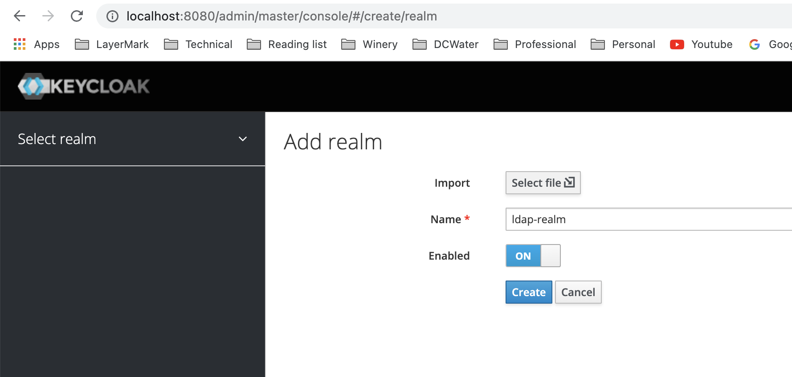
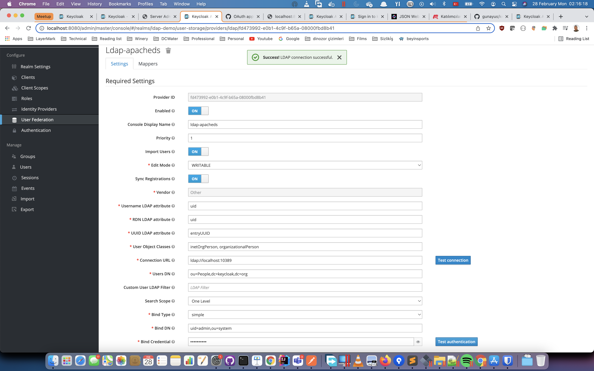
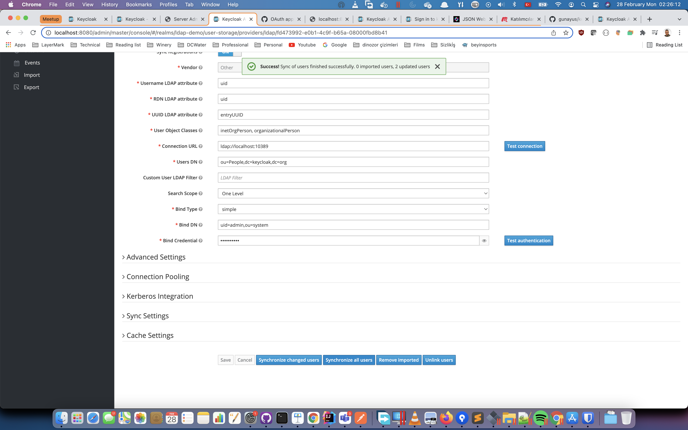
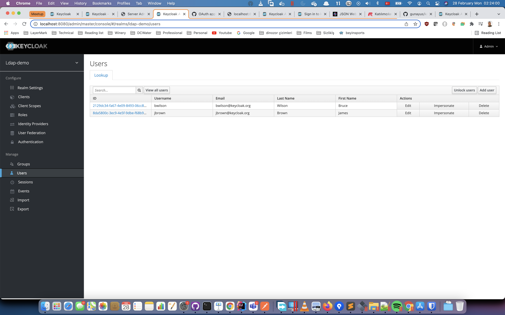

# keycloak-meetup
We aim to explain how we have used keycloak open source identity management platform for providing Single Sign On feature for our customers. 

Keycloak is an Open Source Identity and Access Management tool.
You can use it to add authentication to applications and secure services with minimum effort.
No need to deal with storing users or authenticating users.

Keycloak provides user federation, strong authentication, user management, fine-grained authorization, and more.

for details and new versions, please visit https://www.keycloak.org/

## installing keycloak

for the sake of simplicity, we will use the development version of keycloak, you can simply download the keycloak from following address https://www.keycloak.org/downloads

we have used version 17.0.0. 

+ download the package via https://github.com/keycloak/keycloak/releases/download/17.0.0/keycloak-17.0.0.zip
+ extract the package 
+ run following command ```./bin/kc.sh start-dev```
+ this should start keycloak in development mode at port 8080
+ open http://localhost:8080
+ create a user account for administrating keycloak. e.g. username : admin, password : Secret

## importing realm : ldap-realm
Keycloak uses the concept of realms as kind of tenants. we should create a realm by importing from file provided in this repository 
+ click ```Add realm``` button 
+ select  [ldaprealm.json](ldaprealm.json) file
+ set realm name : ldap-realm
+ see schreen shot 
+ click ```Create``` button 

## running LDAP service
in the scope of this demo, we will use LDAP as authentication manager and authorizing users / groups. therefore an LDAP server should be used. you can use any one of LDAP service
+ Apache DS
+ Redhat freeipa
+ Active Directory
+ etc. 

for simplicity, we will start LDAP service from keycloak source code. 
+ download keycloak source code from this url : https://github.com/keycloak/keycloak/archive/refs/tags/17.0.0.zip
+ extract the zip content
+ overwrite the ldap source file [```ldap-example-users.ldif```](ldap-example-users.ldif) from this repository to ```examples/ldap``` folder in keycloak source code. this modified file contains additional groups and group memberships
+ follow the instructions from the file ```README.md``` in folder  ```examples/ldap``` to start the LDAP service
+ in short you should be able to run following command ```mvn exec:java -Pldap```

## test LDAP connection from keyclaok 
once the LDAP service is running, go back to keycloak realm configuration page to test the connection
+ select realm ```ldap-realm``` if not already selected
+ click ```User Federation``` from the left action buttons
+ click ```ldap-apacheds``` to open details
+ click ```Test connection``` and ```Test authentication``` buttons to make sure that LDAP service can be connected without any issues. 
+ if connected and authenticated successfully in previous step, click on ```Syncronize all users``` button. see imported users from ldap. 
+ click ```Users``` from the left action buttons and view two users imported from LDAP. 
